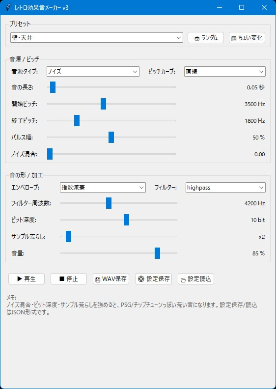

# レトロ効果音メーカー



## 機能概要

レトロゲーム風の効果音をGUIで作成できる、シンプルなSFX生成ツールです。
ノイズ、矩形波、三角波、ピッチ変化、ビットクラッシュなどを組み合わせて、ゲーム用のWAV効果音を手軽に作れます。

### 主な機能

* Python / Tkinter製のGUIツール
* ノイズ、サイン波、矩形波、三角波、ノコギリ波、パルス波に対応
* 開始ピッチ・終了ピッチを指定して、音程変化のある効果音を作成可能
* ピッチカーブを選択可能

  * 直線
  * 指数
  * 急降下
  * 急上昇
  * ランダム階段
* エンベロープ切り替え対応

  * 指数減衰
  * 直線減衰
  * ADSR
  * ゲート
  * 逆再生風
  * ポンピング
* フィルター対応

  * なし
  * lowpass
  * highpass
  * bandpass
* ビットクラッシャー機能
* サンプルレート荒らし機能
* ノイズ混合機能
* ランダム生成、ちょい変化ボタン搭載
* WAV形式で保存可能
* 設定をJSON形式で保存 / 読み込み可能
* ブロック崩し、レトロゲーム、チップチューン系SE作りに便利

### 一言で言うと

「レトロゲームっぽい効果音をGUIで作るツール」

## 使い方

1. **アプリを起動する**

   ターミナルで以下を実行します。

   ```bash
   python sfx-maker-v3.py
   ```

   必要なライブラリが入っていない場合は、先にインストールしてください。

   ```bash
   pip install numpy scipy sounddevice
   ```

2. **ファイルを読み込む**

   このツールは音声素材を読み込むタイプではなく、内部で効果音を生成するタイプのツールです。
   以前保存した設定を使いたい場合は、`📂 設定読込` ボタンからJSON設定ファイルを読み込めます。

3. **設定を行う**

   主な設定項目は以下です。

   * プリセット
     壁・天井、バー、ブロック、レーザー、爆発、決定音などの基本パターンを選べます。

   * 音源タイプ
     ノイズ、サイン波、矩形波、三角波、ノコギリ波、パルス波などを選べます。

   * 音の長さ
     効果音の再生時間を調整します。

   * 開始ピッチ / 終了ピッチ
     音程の変化を設定します。
     高い音から低い音に落とすと爆発やダメージ音、低い音から高い音に上げると取得音や決定音っぽくなります。

   * ピッチカーブ
     音程変化のカーブを選びます。
     レーザーやジャンプ音など、動きのあるSE作りに便利です。

   * ノイズ混合
     波形にノイズを混ぜます。
     強めるとザラついたレトロ感が出ます。

   * エンベロープ
     音の立ち上がりや減衰の形を変更します。

   * フィルター
     lowpass / highpass / bandpass で音の質感を調整できます。

   * ビット深度
     数値を下げると、荒いチップチューン風の音になります。

   * サンプル荒らし
     サンプルレートを粗くしたような効果を加えます。

   * 音量
     出力音量を調整します。

4. **プレビューを確認**

   `▶ 再生` ボタンで現在の設定の音を再生できます。
   音が鳴っている途中で止めたい場合は、`■ 停止` ボタンを押してください。

5. **生成／書き出しを実行する**

   `💾 WAV保存` ボタンから、現在の設定で生成した効果音をWAVファイルとして保存できます。
   出力形式はゲームエンジンなどで扱いやすい16bit PCM WAVです。

   作った音色の設定を残したい場合は、`⚙ 設定保存` ボタンでJSON形式の設定ファイルとして保存できます。
   保存した設定は、あとから `📂 設定読込` で再利用できます。

## おすすめ設定例

### ブロック崩し系

* 壁ヒット
  短め、highpass、ノイズ系、ビット深度やや低め

* パドルヒット
  三角波、低めのピッチ、lowpass、短めの減衰

* ブロック破壊
  ノイズ＋矩形波、ピッチ急降下、ノイズ混合多め、ビット深度低め

### レトロUI系

* 決定音
  矩形波、ピッチ上昇、ADSR、ノイズ少なめ

* キャンセル音
  矩形波、ピッチ下降、短め、少し荒め

* アイテム取得
  三角波またはサイン波、ピッチ上昇、ADSR、明るめの音

### 派手な効果音

* レーザー
  パルス波、急降下カーブ、bandpass、ビットクラッシュ強め

* 爆発
  ノイズ、低めのフィルター、長め、サンプル荒らし強め

迷ったら、まずプリセットを選んでから `🎛 ちょい変化` を押すと、それっぽいバリエーションを作りやすいです。
`🎲 ランダム` は偶然の神に丸投げするボタンです。意外と強いです。

## 必要環境

* Python 3.10以上
* tkinter
* numpy
* scipy
* sounddevice

`tkinter` は多くのPython環境に標準で入っています。
環境によっては別途インストールが必要な場合があります。

必要ライブラリのインストール例:

```bash
pip install numpy scipy sounddevice
```

`sounddevice` が入っていない場合、再生機能は使えません。
ただし、WAV保存は利用できます。

## ライセンス

**MIT License** で公開しています。
ご自由に使って、改変して、参考にしてください。
ただし**自作発言はNG**でお願いします。
